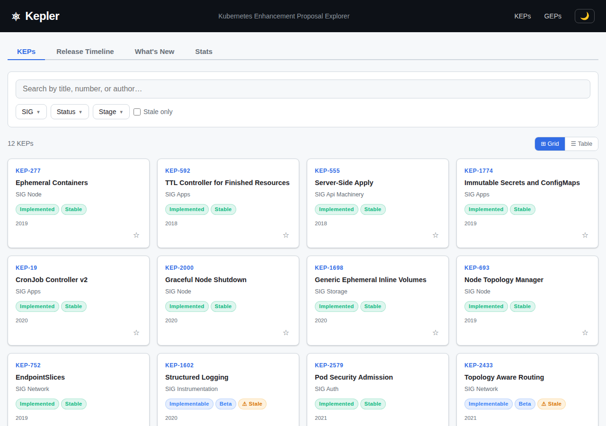
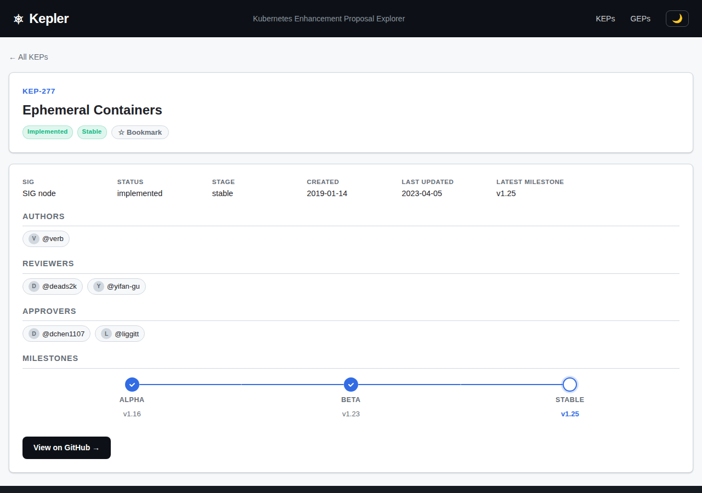

# Kepler – Kubernetes Enhancement Proposal Explorer

A web application for exploring [Kubernetes Enhancement Proposals (KEPs)](https://github.com/kubernetes/enhancements/tree/master/keps) , [Gateway API Enhancement Proposals (GEPs)](https://github.com/kubernetes-sigs/gateway-api/tree/main/geps) and [Cluster API Enhancement Proposals (CAEPs)](https://github.com/kubernetes-sigs/cluster-api/tree/main/docs/proposals).





## Features

### Browsing & Navigation
- 📋 **Browse KEPs, GEPs and CAEPs** fetched live from their respective GitHub repositories
- 🔀 **Grid and table views** — toggle between card grid and sortable table layout
- 📄 **Detail view** showing full metadata: authors, reviewers, approvers, milestones, rendered README, related PRs with CI/review status, and links to GitHub
- ⌨️ **Keyboard navigation** — use arrow keys to move between proposals and `B` to bookmark
- 🗓️ **Release timeline** — see which KEPs were introduced or graduated per Kubernetes release

### Search & Filtering
- 🔍 **Search** by title, KEP/GEP number, or author
- 🎛️ **Filter** by SIG, status (provisional, implementable, implemented, etc.), and stage (alpha, beta, stable)
- 🏷️ **Stale indicator** for proposals not updated in over a year

### Analytics
- 📊 **Statistics dashboard** with charts for:
  - SIG distribution and creation timeline
  - Status breakdown and stage funnel
  - Time-to-stable histogram and milestone heatmap
  - Top contributors

### Personalization
- 🔖 **Bookmarks** saved to localStorage for KEPs, GEPs and CAEPs
- 🌙 **Dark/light theme** toggle persisted to localStorage
- 🔑 **Optional GitHub token** — paste a fine-grained token (public repositories, read-only) to raise the GitHub API limit from 60 to 5,000 requests per hour; it's stored only in your browser and sent only to `api.github.com`
- ⚡ **Client-side caching** in localStorage (6-hour TTL) to avoid re-fetching on subsequent visits
- 🕐 **"What's New" sidebar** showing recently changed proposals from Git history

### General
- 📱 **Responsive** layout that works on mobile and desktop

## Development

```bash
npm install
npm run dev
```

## Build

```bash
npm run build
npm run start
```

## Tech Stack

- [Next.js](https://nextjs.org/) with App Router
- [React](https://react.dev) + [TypeScript](https://www.typescriptlang.org/)
- [js-yaml](https://github.com/nodeca/js-yaml) for parsing KEP/GEP YAML metadata and CAEP front matter
- [react-markdown](https://github.com/remarkjs/react-markdown) + [remark-gfm](https://github.com/remarkjs/remark-gfm) for rendering proposal READMEs
- [Recharts](https://recharts.org/) for analytics charts
- [GitHub REST API](https://docs.github.com/en/rest) + [raw.githubusercontent.com](https://raw.githubusercontent.com) for data fetching
